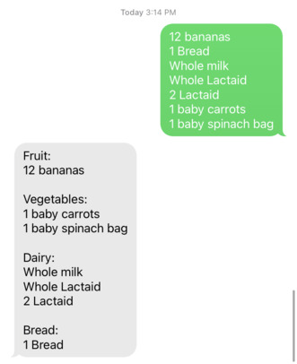

# Grocery Classification

Only one lap around the grocery store...

## Deployment

It's a REST API built with Flask and the Nexmo API. Nexmo posts the inbound sms, the API handles it and texts back a classified grocery list. You'll have to deploy it with a `keys.ini` file with Nexmo contents, expose the port with ngrok or socketxp or something, then give that endpoint to Nexmo.
